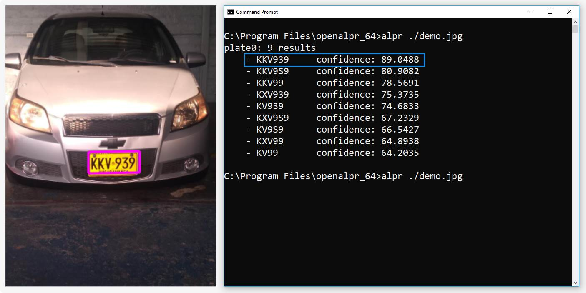

# OpenALPR web service using Docker and Kubernetes

## Overview
This project creates a Kubernetes cluster that provides a REST API for scanning geotagged images that contain license plates and recording them in a Redis database.

You will deploy containers providing the following services.

+ rest - the REST frontend node will accept images for analysis and handle queries concerning specific license plates and geocoordinates. The REST worker will queue tasks to workers using `rabbitmq` messages. Full details are provided in `rest/README.md`
+ worker - Worker nodes will receive work requests to analyze images. Information from scanned images is entered into the Redis database. Full details are provided in `worker/README.md`.
+ rabbitmq - A node named `rabbitmq` will act as a message broker. Full details are provided in `rabbitmq/README.md`.
+ redis - A node named 'redis' will provide the Redis database. Full details are provided in `redis/README.md`.



## Methodology

### RabbitMQ:
1. Pulled most recent RabbitMQ image from Dockerhub
2. Created a Kubernetes pod using the RabbitMQ image
3. Exposed port 5672 (the default RabbitMQ port) with internal IP address to other pods in the cluster

```
bash rabbitmq-launch.sh
```

### Redis:
1. Pulled most recent Redis image from Dockerhub
2. Created a Kubernetes pod using the Redis image
3. Exposed port 6379 (the default Redis port) with internal IP address to other pods in the cluster

```
bash redis-launch.sh
```

### Rest Server:
1. Built image from Dockerfile
2. Tagged the Docker image and pushed to the Google container registry
3. Created a Kubernetes pod using this image
4. Exposed port 5000 (the default Flask port) with type LoadBalancer to create an external IP address

```
bash rest-launch.sh
```

### Worker Node:
1. Built image from Dockerfile
2. Tagged the Docker image and pushed to the Google container registry
3. Created a Kubernetes pod using this image and replicated two additional times
Note: No service needed to be created for the worker nodes.

```
bash worker-launch.sh
```

## Getting started

These instructions will get the OpenALPR web service running on your Google Kubernetes Engine cluster.

### Kubernetes Cluster:
I used a cluster of 3 n1-standard-1 machines for my lab8 Kubernetes cluster.

### Prerequisites

The following packages/tools are necessary to successfully execute the various launch scripts.

- docker
- kubectl
- gcloud

**Installing packages and configuring master VM:**
For convenience, a `vm_setup.sh` script is provided in the main directory of this project. This script can be used to install docker, gcloud, and kubectl command line tools onto a Google Compute Engine virtual machine (VM). This master VM can then be used to easily communicate with the Google Kubernetes Engine cluster.

First, create a new VM (Ubuntu 18.04 preferred) in Google Compute Engine. SSH into the VM, clone the Github repository, and execute the following command.

```
bash vm_setup.sh
```

**Kubernetes cluster:**
I used a cluster of 3 n1-standard-1 machines for my Kubernetes cluster. The Kubernetes cluster may be deployed from the Google Kubernetes Engine GUI or using the following commands.

```
gcloud config set compute/zone us-west1-b
gcloud container clusters create [cluster_name]
```

**Google Kubernetes Engine credentials:**
The following command must be run to get the Google Kubernetes Engine credentials for a particular cluster. It must be run prior to executing any of the launch shell scripts.

```
gcloud container clusters get-credentials [cluster_name]
```

### Launch OpenALPR web service

SSH into the master VM, clone the Github repository, and execute the following commands.

```
bash redis/redis-launch.sh
bash rabbitmq/rabbitmq-launch.sh
bash rest/rest-launch.sh
bash worker/worker-launch.sh
```

## Test OpenALPR web service

my_rest_client.py takes command line arguments and can be used to test the services

```
python rest/my_rest_client.py [server_address] [endpoint] --image_file --hash --license
```

For example, the following command will upload an image called "test.png" from the current directory to the "image" endpoint of a REST API hosted at 0.0.0.0

```
python rest/my_rest_client.py 0.0.0.0 image --image_file test.png
```

### Notes

Each subdirectory contains directions in the appropriate README file.

The `images` directory contains test images.
+ beetle.jpg is not geotagged and has one visible license plate (309-OJN)
+ car.jpg is not geotagged but has one visible license (CZTHEDA)
+ geotagged.jpg is geotagged but has no cars
+ the-meat-car.jpg is geotagged and has one visible license (789-SJL but reported as 7B9SJLD)

## Authors

**Michael W. Chifala** - University of Colorado, Boulder, CSCI 5253: Data Center Scale Computing

## Acknowledgments

* Dirk Grunwald, University of Colorado, Boulder
* Github: PurpleBooth/README-Template.md
* OpenALPR: https://github.com/openalpr/openalpr

You may [want to bookmark this kubernetes "cheat sheet"](https://kubernetes.io/docs/reference/kubectl/cheatsheet/).


The worker will use the [open source automatic license plate reader](https://github.com/openalpr/openalpr) software. This is an open-source component of [a more comprehensive commercial offering](https://openalpr.com). One of the commercial components includes a web service similar to what we're building.


## Suggested Steps

You should first deploy the `rabbitmq` and `redis` deployments because they're easy, particularly if you deploy the versions provided by the developers. For each of those, you'll need to specify a deployment and then create a Service for that deployment. Following that, you should construct the `rest` server because you can use that to test your `redis` database connection as well as connections to `rabbitmq` and your debugging interface. Lastly, start on the `worker`.

Although not explicitly required, you should create a simple python program that connects to the debugging topic exchange as described in `rabbitmq`. You can use that to subscribe to any informational or debug messages to understand what's going on. It's useful to deploy that service as a "logs" pod (or deployment) so you can monitor the output using `kubectl logs logs-<unique id for pod>`
